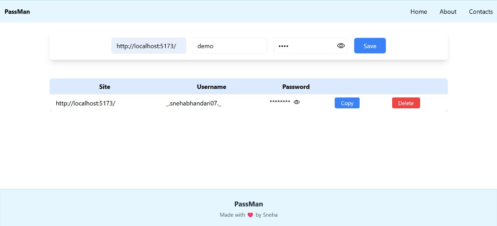
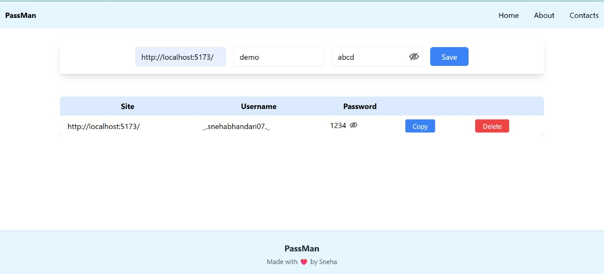

# React Password Manager

A simple and secure password manager built with **React** and **Tailwind CSS**. This project lets users save, view, copy, and delete their passwords locally using the browser's `localStorage`. Passwords can be toggled to show/hide for better visibility and security.

---

## Features

-  Save passwords with site name and username
-  Toggle visibility (show/hide) of individual passwords
-  Copy password to clipboard with one click
-  Delete saved passwords
-  Persistent storage using `localStorage`
-  Component-based architecture (`PasswordManager`, `InputForm`, `ShowTable`)
-  Clean UI using Tailwind CSS

---

## Tech Stack

-  React
-  Tailwind CSS
-  useState, useEffect, useRef
-  LocalStorage API

## Screenshots

## Author

- By Sneha

